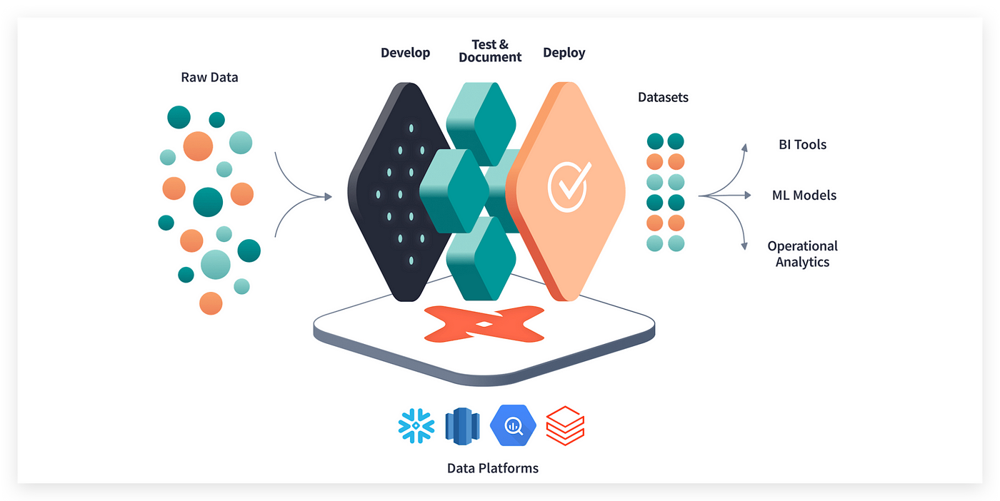
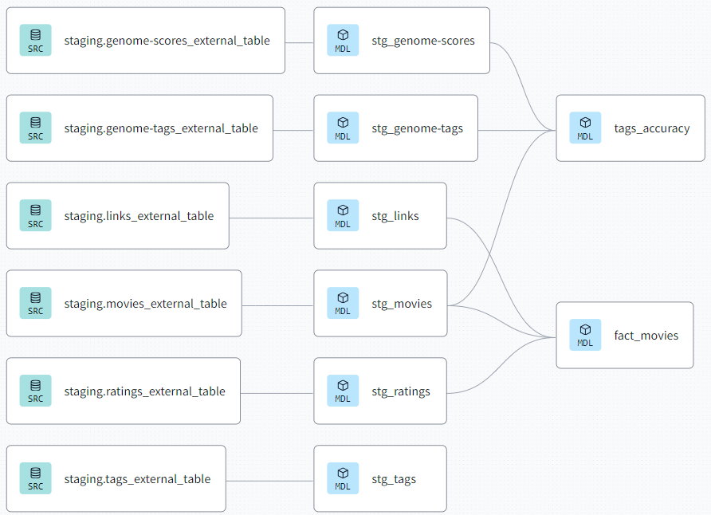

## DBT (Data Build Tool)

data build tool is an open-source command line tool that helps analysts and engineers transform data in their warehouse more effectively

The following linear graph shows the all the transformation that happens to the data after running dbt.

The as the linear graph shows there are three steps in the dbt workflow. first source data which is getting the data from six different sources and then staging data which consist mainly of casting and other transformations. lastly the core model which has further more transformation and merging all the data into two models.

#### here is a summery of the most important features implemented in the dbt workflow:
* Data freshness has been set to 1 year.
* Tests: 3 unique tests are created and 5 relationship tests are created.
* Schemas are created with descriptions with is important for auto documentation feature DBT offer
* The move title have been split into two columns. one have the title and the other have the release year of the movie. for example "Toy Story (1995)" >> "Toy Story" and "1995"
* A limit of a 100 has been set on all query in development environment to speed up the development.
* In staging filter has been set to remove repeated rows from sources.
* all columns have been casted to correct data types.
* In the final core model all movies with less than 20 reviews (unreliable data) has been removed.
* explode the genres column to normalize the data.
* Tags table has not been merged as it was not very useful for the dashboard but kept id needed in future.
* Two jobs have been set first automatic weekly job to update data in production and CI (continuous integration) job to run modified models and tests every time a pull request is made to make sure nothing is broken. which is a consider a best practice.