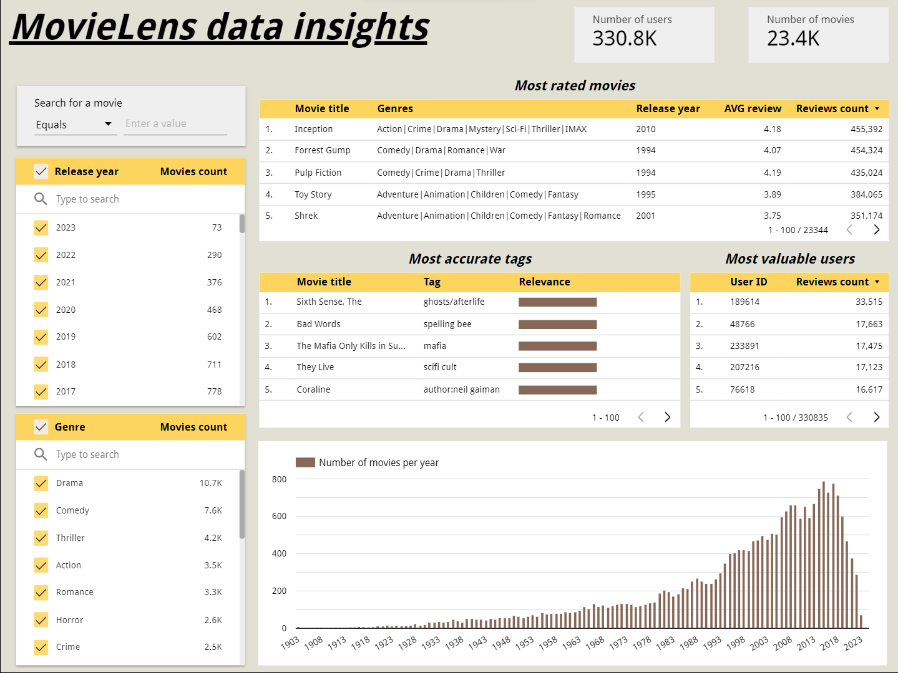

# MovieLens data pipeline Project

## Table of Contents
- [MovieLens data pipeline Project](#movielens-data-pipeline-project)
  - [Table of Contents](#table-of-contents)
  - [Overview](#overview)
  - [Problem description](#problem-description)
  - [dataset](#dataset)
      - [Dataset source:](#dataset-source)
      - [Overview:](#overview-1)
  - [Technologies](#technologies)
  - [Project architecture](#project-architecture)
  - [Dashboard](#dashboard)
  - [Replication instruction:](#replication-instruction)
      - [go to the folder of the project created and so and so (on progress)](#go-to-the-folder-of-the-project-created-and-so-and-so-on-progress)

## Overview
This project is based on [Data Engineering Zoomcamp](https://github.com/DataTalksClub/data-engineering-zoomcamp) course held by [DataTalks.Club](https://datatalks.club/) with the goal of implementing everything tought in the course and build an end-to-end data pipeline.

## Problem description
Using the data answering some key questions such as what is the most rated movies on the website? how accurate tags given by users to the movies? who are the most valuable users to the websites? 

Project goals:
* building ELT end-to-end batch data pipeline that process the data on monthly basis.
* build Dashboard that will help in visualizing the data and extract usful information that help the website.

## dataset
#### Dataset source:
[MovieLens Latest Datasets](https://grouplens.org/datasets/movielens/) under MovieLens Latest Datasets full version
#### Overview:
The dataset from [MovieLens](https://movielens.org/) website is  5-star ratings system for movies. 

* It comprises ≈ 33M ratings and ≈ 2M tag applications for ≈ 86K movies, created by ≈ 331K users from January 9, 1995, to July 20, 2023.

* Users were randomly selected and had rated at least one movie. No demographic information is included; each user is identified only by an ID.

* The dataset composes of six files which are genome-scores.csv, genome-tags.csv, links.csv, movies.csv, ratings.csv, and tags.csv.

* (tags.csv table) have not been used in the dashboard as it was not very useful. The dataset gets updated overtime however the download link doesnt change

The following diagram help in visualizing the dataset and show the database relationship:


More information about the dataset available here: [dataset_description](dataset.txt)
## Technologies
The project uses the following technologies:

* Workflow orchestration:  
* Cloud:  
  * Data Lake (DL): GCS
  * Data Warehouse (DWH): BigQuery
* Infrastructure as code (IaC):  
* Transforming data:  
* Data Visualization: 

## Project architecture
The end-to-end batch pipeline as shown in the diagram below:
* Download the data from URL and trasform it from csv to parquet.
* Load the data into GCS (data lake)
* Load the data from GCS into BigQuery (DWH)
* Transform the data using DBT(Data Build Tool) in the BigQuery
* Load the data from BigQuery to Looker Studio


## Dashboard

The Dashboard can be accessed in the using the following link: [Dashboard](https://lookerstudio.google.com/reporting/a937b3d1-6f12-4857-827d-347ab817960d)

Note: Most accurate tags table take more time than the rest please be patient. it have to go through more data than the reset.



Controls have been added making the dashboard interavtive. filters can be added to get movies based on the spacific year or spacific genre

most valuable users to the websites as they made the most contributions, most accurate tags given by user compare to the tags given by the website using machine learning model

## Replication instruction:

The instuction below can be followed to replicate the project:

because you cloning subdirectory of the repo the usual git clone command will be a bit different so you will need to do the following:

```
mkdir ML_repo
cd ML_repo
git init
git remote add -f origin https://github.com/mahmoud-mahdy/My_Portfolio.git
git config core.sparseCheckout true
echo "MovieLens_data_pipeline" >> .git/info/sparse-checkout
git pull origin main
```
#### go to the folder of the project created and so and so (on progress)
