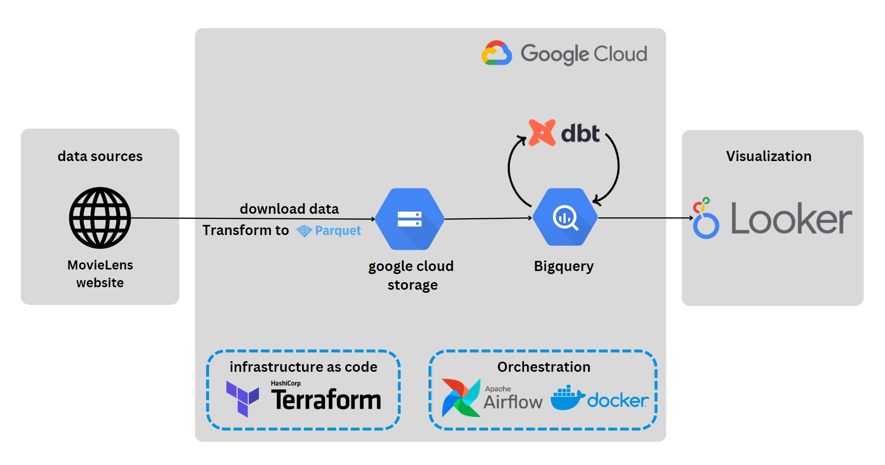

# MovieLens data pipeline Project
## Overview
This project is based on [Data Engineering Zoomcamp](https://github.com/DataTalksClub/data-engineering-zoomcamp) course held by [DataTalks.Club](https://datatalks.club/) with the goal of implementing everything tought in the course and build an end-to-end data pipeline.

## Problem description

## dataset
https://grouplens.org/datasets/movielens/

## Technologies

## Project architecture

## dashboard link

https://lookerstudio.google.com/reporting/a937b3d1-6f12-4857-827d-347ab817960d

