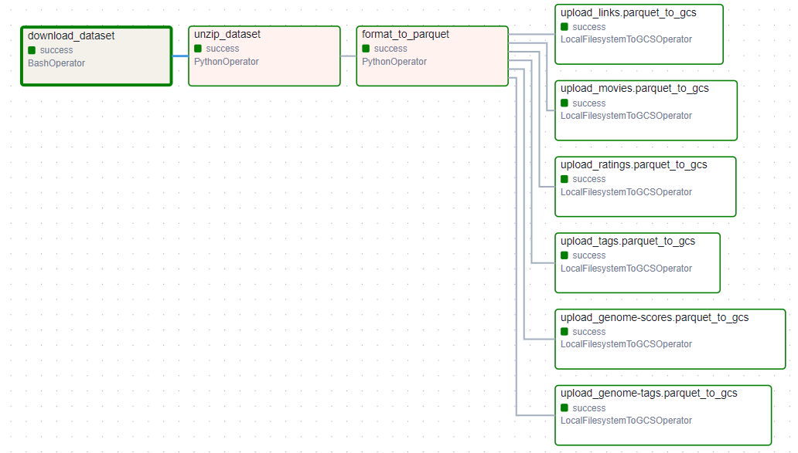
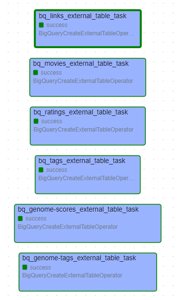

Apache Airflow is an open-source workflow management platform for data engineering pipelines. It started at Airbnb in October 2014.

Airflow can programmatically author, schedule, and monitor workflows. It allows you to define workflows as code, manage dependencies, and schedule when each part of the workflow should be executed.

## Pipeline overview:
The two dags below shows the structure of the pipeline.

DAG_1: 

download the data from the URL > unzip the data > transform the data from csv to parquet format > upload the parquet file to GCS bucket (Data lake)

DAG_2:

Read all the files in the GCS bucket (Data lake) > move the files found to bigquery Dataset (MovieLens)

Pipeline is scheduled to execute monthly as a reasonable period to check for updated data.
The pipeline overwrite the existing old data locally and update the one in the gcs bucket if old one exist.

Which is convenient as no modification is needed weather there is old data in the data lake or not.